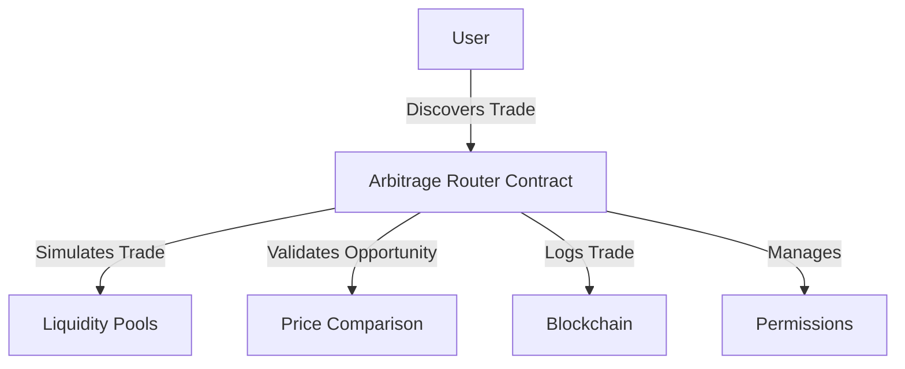

# Arbitrage Find

A decentralized cross-DEX arbitrage trade discovery and execution platform built on the Stacks blockchain.

## Overview

Arbitrage Find provides a blockchain-based solution for discovering and executing cross-DEX token swap opportunities. By comparing liquidity pools and tracking price discrepancies, the platform enables users to identify and capitalize on potential arbitrage trades with minimal overhead.

### Key Features
- Cross-DEX price discovery
- Arbitrage trade simulation
- Liquidity pool tracking
- Trade execution validation
- Historical arbitrage trade logging
- Granular access permissions

### Use Cases
- Cryptocurrency trading optimization
- Decentralized finance (DeFi) arbitrage
- Automated trading strategy research
- Liquidity pool analysis
- Low-risk trading opportunities

## Architecture

The system is built around a core smart contract that manages liquidity pool tracking, arbitrage simulation, and trade execution. Here's how it works:



### Core Components
- Liquidity Pool Registry
- Arbitrage Trade Simulator
- Trade Execution Module
- Permissions Management
- Trade History Tracking

## Contract Documentation

### arbitrage-router.clar

The main contract handling arbitrage trade discovery and execution.

#### Permission Levels
- NONE (0): No access
- VIEW (1): Can view pool and trade data
- EXECUTE (2): Can simulate and execute trades
- ADMIN (3): Can register pools and manage permissions

#### Key Data Structures
- `liquidity-pools`: Tracks registered DEX liquidity pools
- `arbitrage-history`: Logs historical arbitrage trades
- `contract-permissions`: Manages user access levels

## Getting Started

### Prerequisites
- Clarinet
- Stacks wallet
- Access to multiple DEX platforms

### Installation
1. Clone the repository
2. Install dependencies
3. Deploy using Clarinet

```bash
clarinet deploy
```

### Basic Usage

1. Register a liquidity pool:
```clarity
(contract-call? .arbitrage-router register-pool
    "pool-123"
    "stackswap"
    .token-a
    .token-b
    u10000
    u5000
    u30)
```

2. Simulate an arbitrage trade:
```clarity
(contract-call? .arbitrage-router simulate-arbitrage
    "source-pool"
    "dest-pool"
    .token-x
    u1000)
```

## Function Reference

### Liquidity Pool Management
- `register-pool`: Add a new liquidity pool for tracking
- `get-liquidity-pool`: Retrieve pool details

### Arbitrage Trading
- `simulate-arbitrage`: Validate potential arbitrage trade
- `execute-arbitrage`: Perform cross-DEX token swap
- `get-arbitrage-trade`: Retrieve trade history

### Permission Management
- `grant-contract-permission`: Set user access levels

## Development

### Testing
Run the test suite using Clarinet:
```bash
clarinet test
```

### Local Development
1. Start Clarinet console:
```bash
clarinet console
```

2. Deploy contracts:
```clarity
(contract-call? .arbitrage-router ...)
```

## Security Considerations

### Key Security Features
- Trade simulation before execution
- Profit threshold validation
- Granular user permissions
- Immutable trade history logging

### Best Practices
1. Always validate trade profitability
2. Use appropriate permission levels
3. Monitor liquidity pool changes
4. Implement additional risk management
5. Keep private keys secure

### Limitations
- Gas costs for trade simulation
- Real-time price discovery challenges
- Dependent on external DEX liquidity
- Market volatility risks